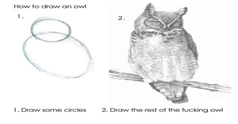

# The Golem of Prague

vidéo: <https://www.youtube.com/watch?v=cclUd_HoRlo>

Cours pour les scientifiques s'intéressant à la science et pour cela ont besoin de données. 

Le rejet de l'*Ho* est trop pauvre. 

Repenser le rôle de stats en recherche : intégrer science et stats.

Trois type de créatures:  
* Golems  
* Owls  
* Do[a]gs
		
## Golems
 
Le golem est puissant mais n'a pas de volonté propre. C'est pareil pour les modèles statistiques. 

Les *flowcharts* de choix de test sont utiles dans des conditions très contrôlées.

La relation entre l'hypothèse scientifique et les hypothèses de test ne sont pas clairs. Les modèles statistiques examinent des association et pas des relations causales.

Il y a des hypothèses scientifiques, elles peuvent être liées à des processus modèles que l'on va relier à des modèles statistiques. Hors on peut avoir plusieurs processuspour une hypothèses et eux même peuvent avoir plusieurs modèles statistiques. Il est même possible d'avoir un modèle statistique qui match plusieurs hypothèses différentes.

Un équivalent en écologie peut être le cas des niches écologiques. 

Il est important de clarifier les différents liens entre hypothèses - processus - modèles statistiques.

## Owls

Les experts ne sont pas toujours conscient de toutes les étapes par lesquelles ils passent pour dessiner un hiboux. Être proche d'experts permet de se rendre compte de ce qu'ils mettent sous le tapis. 

Dans ce cours ces différentes étapes signifient:    
* Produire des lignes de codes  
* Se forcer à expliciter nos hypothèses sous forme de codes

C'est important pour:  
* comprendre ce que l'on fait  
* documenter son travail est bien pour soi et la reproductibilité   
* une rigueur scientifique  

La méthode:
	
	1. Que cherche-t-on a estimer ? (*theoretical estimand*)

	2. Les modèles scientifiques causales.

	3. Construire des modèles scientifiques à partir des deux points précédents. 

	4. Simuler à partir de 2 pour valider 3 en tenant compte de 1

	5. Analyser les données  

Avantages de Bayes:

- Approche flexible  
- Permet de poser les incertitudes à chaque niveau d'analyse  
- Des solutions pour les erreurs de mesure et les données manquantes  
- Un focus sur la modélisation scientifique  

Un seul estimateur: distribution a posteriori (*posterior distribution*)

 **On choisit des modèles statistiques non pas en fonction des données mais en fonction de ce qui produit ces données**
 
> No causes in; no causes out.

On a besoin de modèle scientifique y compris pour des travaux d'observation. L'échantillon n'est pas la population, décrire la population nécessite un modèle. 
 
Qu'est ce qu'une inférence causale?
 
	* Plus qu'une association  
	* Inference causale est un type de prediction  
		Connaissant une cause on peut prédire les conséquences de son intervention 
	* Imputation des valeurs manquantes  
		Connaitre une cause signifie que l´on peut contruire des scenarios alternatifs  
		

## DAGs

DAG: Directed Acyclic graphs  

Ce sont des modelés de causalités heuristiques.

Ils sont utilisés pour représenter les processus. 

On peut les utiliser pour mettre en place des tests. 

## Synthèse

**Golems**: stupide mais puissant modèles statistiques 

**Owls**: procédures objectives et documentées

**DAGs**: Assomptions scientifiques transparentes pour:  
		- justifier l'effort scientifique  
		- le partager à une crtique utile  
		- connecter les théories aux golems
		

 
